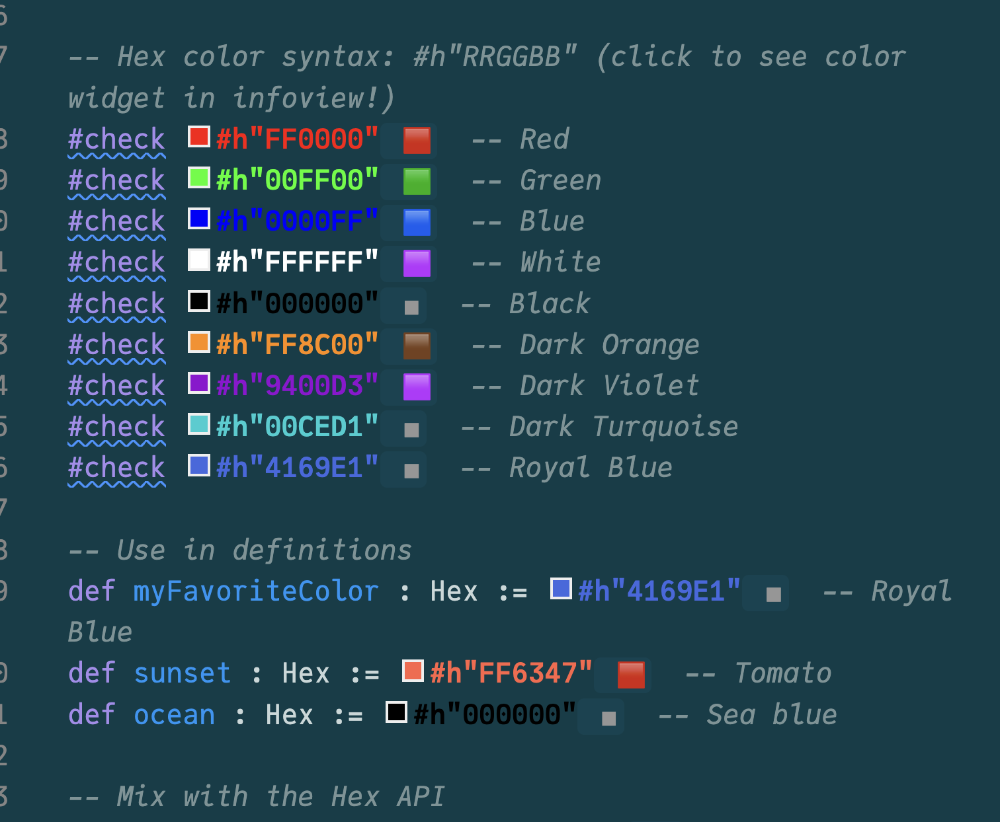

# HexLuthor

Lean 4 hex color syntax with inline VS Code visualization.



## Features

- Custom `#xRRGGBB` syntax for hex colors (no quotes needed!)
- Inline colored text in editor (via VS Code extension)
- Color swatches in infoview panel (via ProofWidgets)
- Human-friendly color names (CSS standard, closest match for non-exact)
- Color picker with 2-way sync

## Usage

```lean
import HexLuthor.HexColor
open HexLuthor

#check #xFF0000  -- Red
#check #x4169E1  -- RoyalBlue

def myColor : Hex := #x00CED1  -- DarkTurquoise
```

## Installation

Add to your `lakefile.toml`:

```toml
[[require]]
name = "HexLuthor"
git = "https://github.com/alok/HexLuthor"
rev = "main"
```

Then `lake update`.

## VS Code Extension

For colored text in the editor, install the bundled extension:

```bash
code --install-extension vscode-hexluthor/hexluthor-colors-*.vsix
```

## License

Apache 2.0
